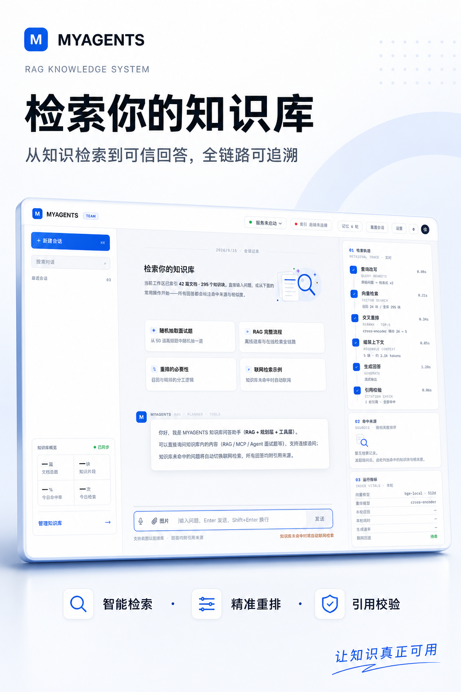

# MYAGENTS

> 本地运行的 Markdown 知识库助手，支持混合检索、多轮会话、工作区切换和桌面启动。

[](https://www.python.org/)
[](#安全说明)

<p align="center">
  <a href="assets/myagents-poster.png">
    
  </a>
</p>

MYAGENTS 可以把 Markdown 文档目录变成可检索、可连续对话的知识工作区。它使用向量检索和 BM25 查找内容，可选用交叉编码器精排，并在本地保存工作区、会话和反馈。

项目刻意保持核心轻量：HTTP 服务、会话存储、向量库、BM25 索引、规划器、执行器和模型客户端均未依赖大型应用框架，方便阅读、修改和二次开发。

## 核心能力

- **混合 RAG**：结合向量检索与 BM25，并使用 RRF 完成结果融合。
- **两阶段检索**：叶子块宽召回、可选精排、父块上下文扩展。
- **Agent 工作流**：结构化规划、工具执行、回答生成和引用校验。
- **持久化会话**：使用 SQLite 保存历史记录，重启后可继续对话。
- **会话记忆隔离**：不同会话分别恢复上下文，不会相互串线。
- **多工作区**：切换不同知识库目录及其独立会话列表。
- **本地 Web UI**：支持流式回答、思考动画、图片问答、语音输入、反馈、复制、设置、指标和日志。
- **联网降级**：知识库无法回答时，可切换公开网页搜索。
- **执行可观测**：展示检索轨迹、引用来源、耗时、Token 和成本估算。
- **本地优先**：默认仅监听 `127.0.0.1`，密钥和运行数据不会进入 Git。

## Web 界面

Web UI 当前支持：

- 工作区创建与切换；
- 多会话管理、单条删除及跨重启恢复；
- 每个会话独立的后端记忆；
- 检索轨迹、引用来源和运行指标；
- 回答复制及“有用 / 没用”反馈；
- 图片上传和可选语音输入；
- 模型、检索、视觉、知识库、工作区和日志设置；
- 今日检索次数和知识库命中率；
- 日志筛选、搜索、自动刷新、下载和清空。
- 实时后端与索引状态，不使用静态占位文案。

> 必须通过本地服务打开页面。直接使用 `file://` 打开 `scripts/webui.html`，浏览器无法可靠访问后端接口。

## 系统架构

```text
用户问题
   |
   v
会话记忆 -> 规划器 -> 执行器 -> 工具
                              |    |
                              |    +-> 联网搜索
                              v
                         混合检索器
                         /       \
                    向量检索    BM25
                         \       /
                           RRF 融合
                               |
                            可选精排
                               |
                        父块上下文 + LLM
                               |
                    回答 + 引用 + 运行指标
```

离线索引流程：

```text
Markdown -> 清洗 -> 父块 -> 叶子块 -> 向量化 -> 本地索引
```

## 快速开始

### 环境要求

- Python 3.10 或更高版本
- 用于生成回答的 DeepSeek 兼容 API Key
- 一个包含 Markdown 文档的目录

### 安装

```bash
git clone https://github.com/lyndonxn/myAgents.git
cd myAgents

python3 -m venv .venv
source .venv/bin/activate
pip install -r requirements.txt
```

可选安装本地向量与重排模型：

```bash
pip install "sentence-transformers>=3.0"
```

如果未安装 `sentence-transformers`，系统会自动降级为内置的 TF-IDF 哈希向量后端。

### macOS：双击启动

完成安装后，在 Finder 中双击：

```text
dist/MYAGENTS.app
```

启动器会关闭当前项目遗留的 MYAGENTS 进程，在 `8787–8797` 中选择空闲端口，等待后端就绪后再打开浏览器。其他项目即使使用相邻端口也不会被结束。

第一次进入页面时会自动打开模型设置。选择 DeepSeek 后只需填写 API Key，地址、模型和生成参数已有默认值。检索设置提供“均衡、快速、深度”三个预设。

关闭所有 MYAGENTS 页面后，本地后端会在约 15 秒内退出。

### 在页面中配置 API

打开“设置 → 模型”，选择模型服务并填写 API Key。保存后即可提问，密钥不会在设置接口中回传明文。

命令行用户也可以使用 `.env`：

创建本地环境文件：

```bash
cp .env.example .env
```

在 `.env` 中填写：

```dotenv
DEEPSEEK_API_KEY=replace-with-your-api-key
```

将 Markdown 文件放入 `knowledge_base/`，或者修改 `config.yaml` 中的 `kb_path`。

主要配置项：

| 配置段 | 用途 |
| --- | --- |
| `chunking` | 父块、叶子块大小，重叠区间和排除目录 |
| `embedding` | 本地模型或 TF-IDF 向量后端 |
| `retrieval` | Top K、融合方式、精排和多查询检索 |
| `llm` | Base URL、模型、温度、输出限制和超时 |
| `planner` | 规划模型和最大执行步骤数 |
| `tools` | 计算器、时间、主题和联网搜索开关 |

### 构建索引

```bash
PYTHONPATH=src python -m scripts.build_index
```

可选开启上下文增强：

```bash
PYTHONPATH=src python -m scripts.build_index --augment
```

### 启动 Web 界面

```bash
PYTHONPATH=src python -m agents.web_server --port 8787
```

浏览器访问 [http://127.0.0.1:8787/](http://127.0.0.1:8787/)。也可以使用便捷入口：

```bash
python -m scripts.webui
```

### 使用命令行

```bash
# 单次提问
python -m scripts.ask --question "什么是 RAG？"

# 交互式对话
python -m scripts.ask

# 显示规划、工具调用和检索详情
python -m scripts.ask --question "解释完整检索流程" --verbose
```

交互模式命令：

- `/mem`：查看当前记忆；
- `/reset`：清空当前记忆；
- `exit`：退出交互模式。

## 检索流程

| 阶段 | 实现方式 |
| --- | --- |
| 文档解析 | 清洗 Markdown、元数据和噪声内容 |
| 父子分块 | 小叶子块用于召回，大父块用于提供完整上下文 |
| 混合召回 | 向量 / TF-IDF 检索与 BM25 关键词检索 |
| 结果融合 | RRF 或可配置的加权融合 |
| 精排 | 可选 Cross-Encoder 或 LLM 重排 |
| 去重 | 合并近似重复的父块上下文 |
| 回答生成 | 组装检索证据并附带引用来源 |

## 数据持久化

Web 会话保存在 `data/webui.sqlite3`，包括：

- 工作区；
- 会话和有序消息；
- 回答反馈；
- 每日查询及知识库命中事件。

删除会话时，该会话的消息、记忆和检索统计会一并删除。删除操作不可恢复。

索引、运行时设置、数据库、日志、评测结果、私人知识库内容和 `.env` 均已通过 `.gitignore` 排除。

## 测试

测试不依赖在线模型接口：

```bash
python -m py_compile src/agents/*.py scripts/*.py tests/*.py
.venv/bin/python tests/test_smoke.py
.venv/bin/python tests/test_web_store.py
```

覆盖范围包括 Markdown 清洗、向量后端、向量检索、BM25、混合检索、分块、会话记忆、SQLite 重启持久化、会话隔离、工作区、反馈和统计。

## 评测

```bash
python -m benchmark.run_benchmark
```

仅评测检索效果，不产生模型生成费用：

```bash
python -m benchmark.run_benchmark --retrieval-only
```

生成的 `benchmark/results.json` 和 `benchmark/results.md` 不会提交到 Git。

## 项目结构

```text
myAgents/
├── config.yaml
├── dist/MYAGENTS.app/       # macOS 双击启动器
├── knowledge_base/          # 本地 Markdown，内容不会提交
├── scripts/                 # CLI、索引构建、Web 启动器和前端
├── src/agents/
│   ├── agent.py             # Agent 编排门面
│   ├── planner.py           # 结构化规划
│   ├── executor.py          # 工具执行
│   ├── tools.py             # 工具注册表
│   ├── retriever.py         # 混合检索管线
│   ├── vector_store.py      # 本地向量索引
│   ├── bm25.py              # 关键词索引
│   ├── embeddings.py        # 本地与 TF-IDF 向量后端
│   ├── reranker.py          # Cross-Encoder / LLM 精排
│   ├── memory.py            # 进程内会话记忆
│   ├── web_store.py         # SQLite 持久化
│   ├── web_server.py        # 本地 HTTP API
│   ├── web_search.py        # 公开网页搜索降级
│   └── llm.py               # OpenAI 兼容模型客户端
├── benchmark/
└── tests/
```

## 安全说明

- Web 服务默认仅监听 `127.0.0.1`；
- 校验 Host 请求头和静态文件路径；
- 限制请求体和图片大小；
- 设置接口不会返回完整 API Key；
- 密钥和运行数据均被 `.gitignore` 排除。

如需开放到局域网或公网，请先增加身份认证、HTTPS、请求限流，并换用生产级 HTTP 服务。详细威胁模型和残余风险见 [SECURITY.md](SECURITY.md)。

## 常见问题

### 页面提示 `Failed to fetch`

不要直接打开 `scripts/webui.html`。地址栏以 `file://` 开头时，页面没有连接本地后端。请双击 `dist/MYAGENTS.app`，或使用命令启动 Web 服务后访问 `http://127.0.0.1:端口/`。

### 问答正常，但索引显示“后端未连接”

新版页面每 5 秒读取一次 `/api/status`，知识库统计接口失败不会再把整个后端标为断开。看到旧状态时，关闭旧页面并重新双击应用，确保启动的是当前代码。

### 启动时停在模型下载

精排模型只从本地目录或缓存加载，不会在桌面启动阶段自动下载。模型不存在时会跳过精排，混合检索仍可使用。

### macOS 阻止打开应用

在 Finder 中右键 `MYAGENTS.app`，选择“打开”。应用依赖项目目录中的 `.venv`，移动项目后需要重新确认路径和环境。

启动失败时查看：

```text
data/desktop-launcher.log
```

## 维护

本地配置、验证流程、发布检查、数据备份和密钥处理方式见 [MAINTENANCE.md](MAINTENANCE.md)。

## 开源协议

项目暂未选择开源协议。仓库目前可以公开查看，但在添加许可证之前，仍适用默认版权限制。
